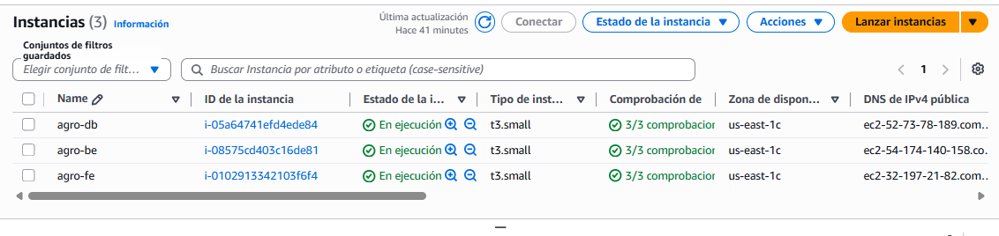
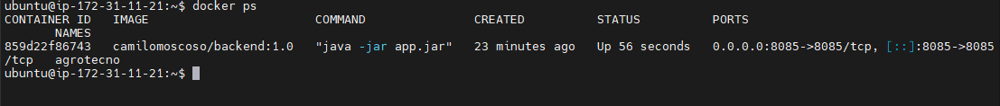
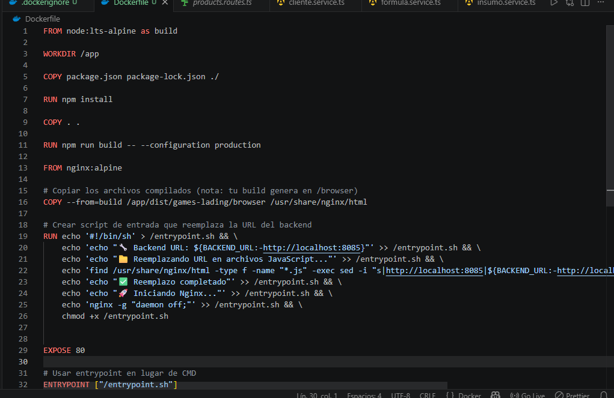
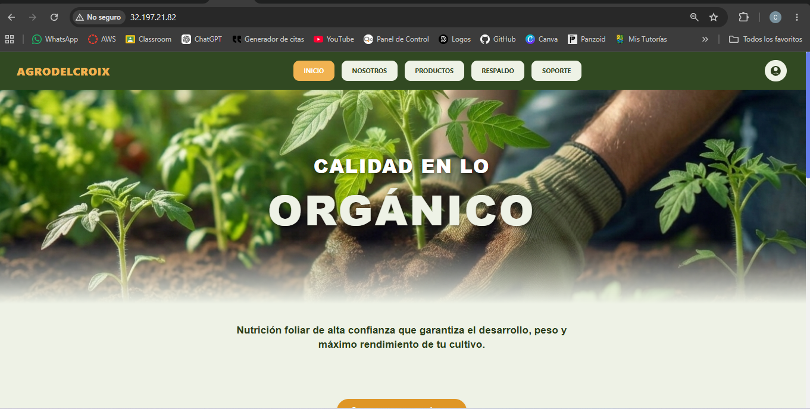
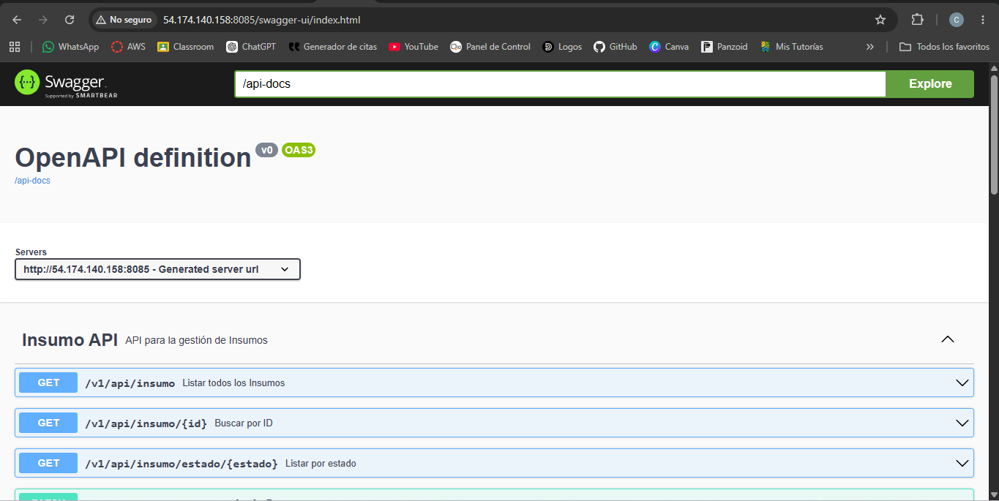

# 🌾 AgroTecno - Despliegue en AWS


| **Dato** | **Información** |
|----------|-----------------|
| **Autor** | Camilo Dionicio Moscoso Duran |
| **Curso** | Redes y Contenedores |
| **Fecha** | 21/02/2026 |

---

## 📌 Resumen Rápido

| Servicio | Estado | URL / IP |
|----------|--------|----------|
| Frontend | ✅ Activo | http://32.197.21.82 |
| Backend  | ✅ Activo | http://54.174.140.158:8085 |
| Database | ✅ Activo | 52.73.78.189:1433 |

---

## 🎯 Accesos Directos

| Recurso | Enlace |
|---------|--------|
| 🌐 Aplicación Web | http://32.197.21.82 |
| 📚 Swagger API    | http://54.174.140.158:8085/swagger-ui/index.html |
| 🔧 Backend API    | http://54.174.140.158:8085 |

---

## ✅ Checklist de Despliegue

- [x] 3 Instancias EC2 (Ubuntu 24, t3.small)
- [x] Security Groups configurados
- [x] Docker instalado en cada instancia
- [x] Contenedor SQL Server corriendo
- [x] Contenedor Backend corriendo
- [x] Contenedor Frontend corriendo
- [x] Comunicación Frontend ↔ Backend verificada
- [x] Comunicación Backend ↔ DB verificada

---

## 🔒 Security Groups

| Instancia | Puertos abiertos | Origen |
|-----------|------------------|--------|
| Frontend  | 22, 80           | 0.0.0.0/0 |
| Backend   | 22, 8085         | IP Frontend |
| Database  | 22, 1433         | IP Backend |

---

## 🚀 Guía de Despliegue

### 1️⃣ Instalar Docker (en cada EC2)

```bash
sudo apt update && sudo apt install docker.io -y
sudo systemctl start docker
sudo systemctl enable docker
sudo usermod -aG docker $USER
newgrp docker
```

### 2️⃣ Levantar Base de Datos — EC2-Database (`52.73.78.189`)

```bash
docker pull camilomoscoso/sql-server:2022

docker run -d \
  -e 'ACCEPT_EULA=Y' \
  -e 'MSSQL_SA_PASSWORD=Admin12345' \
  -p 1433:1433 \
  --name sql-server-db \
  camilomoscoso/sql-server:2022
```

### 3️⃣ Levantar Backend — EC2-Backend (`54.174.140.158`)

```bash
docker pull camilomoscoso/backend:1.0

docker run -d \
  -p 8085:8085 \
  --name agrotecno \
  -e SPRING_DATASOURCE_URL="jdbc:sqlserver://52.73.78.189:1433;databaseName=agroTecno_db;encrypt=true;trustServerCertificate=true" \
  -e SPRING_DATASOURCE_USERNAME="sa" \
  -e SPRING_DATASOURCE_PASSWORD="Admin12345" \
  -e DATABASE_DRIVER="com.microsoft.sqlserver.jdbc.SQLServerDriver" \
  camilomoscoso/backend:1.0
```

### 4️⃣ Levantar Frontend — EC2-Frontend (`32.197.21.82`)

```bash
docker pull camilomoscoso/frontend:latest

docker run -d \
  -p 80:80 \
  --name frontend \
  -e BACKEND_URL="http://54.174.140.158:8085/" \
  camilomoscoso/frontend:latest
```

---

## 🔧 Comandos Útiles (Cheat Sheet)

```bash
# Ver contenedores activos
docker ps

# Ver logs de un contenedor
docker logs -f <nombre-contenedor>

# Reiniciar contenedor
docker restart <nombre-contenedor>

# Detener contenedor
docker stop <nombre-contenedor>

# Probar API desde EC2-Frontend
curl http://54.174.140.158:8085/swagger-ui/index.html

# Probar conectividad a la base de datos
nc -zv 52.73.78.189 1433

# Acceder a SQL Server desde el contenedor
docker exec -it sql-server-db /opt/mssql-tools18/bin/sqlcmd \
  -S localhost -U sa -P 'Admin12345' -Q "SELECT @@VERSION" -C
```

---

## 🐛 Errores Conocidos y Soluciones

| # | Error | Causa | Solución |
|---|-------|-------|----------|
| 1 | `Connection refused` al conectar backend con DB | SQL Server no terminó de iniciarse | Esperar ~20 segundos y reiniciar el backend |
| 2 | `certificate verify failed` en sqlcmd | SQL Server 2022 exige cifrado por defecto | Agregar el flag `-C` al ejecutar sqlcmd |

---

## 🖼️ Galería de Evidencias

| | | |
|:-:|:-:|:-:|
|  |  |  |
| *Instancias EC2* | *Contenedores corriendo* | *Security Groups* |
|  |  |  |
| *Dockerfiles* | *Frontend funcionando* | *Backend Swagger* |

---

## 🔗 Imágenes en DockerHub

| Componente | Comando |
|------------|---------|
| Frontend   | `docker pull camilomoscoso/frontend:latest` |
| Backend    | `docker pull camilomoscoso/backend:1.0` |
| SQL Server | `docker pull camilomoscoso/sql-server:2022` |

---

## 📁 Estructura del Repositorio

```
Conexion_proyecto/
├── backend/
│   └── Dockerfile
├── frontend/
│   └── Dockerfile
├── database/
│   └── agroTecno.sql
├── capturas/
│   ├── 1-ec2.png
│   ├── 2-docker-ps.png
│   ├── 3-security-groups.png
│   ├── 4-Dockerfile.png
│   ├── 5-frontend.png
│   └── 6-backend.png
└── README.md
```

---

## 📝 Notas Adicionales

- Todas las instancias EC2 son tipo **t3.small** con Ubuntu 24.
- La base de datos usa autenticación mixta con contraseña `Admin12345`.
- El backend expone documentación Swagger en `/swagger-ui/index.html`.
- La comunicación entre capas usa IPs públicas con Security Groups restringidos.

---

## 👨‍💻 Autor

**Camilo Dionicio Moscoso Duran**  
Redes y Contenedores — 21/02/2026